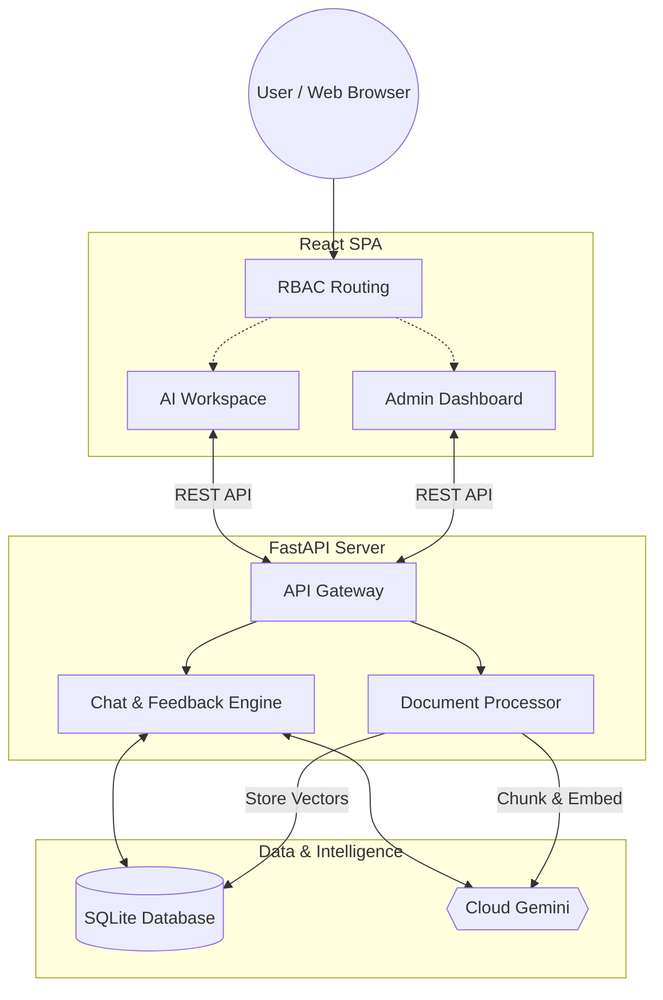

# OmniMind Detailed Documentation

OmniMind is a sophisticated, enterprise-grade AI knowledge platform designed specifically to streamline and augment European banking workflows. It leverages cutting-edge Retrieval-Augmented Generation (RAG) techniques alongside specialized AI agents to deliver highly contextual, secure, and accurate intelligence to end users.

---

## 1. Core Architecture Overview

OmniMind follows a decoupled, modern web application architecture consisting of a frontend client and a backend API server.

- **Frontend (Client)**: A Single Page Application (SPA) responsible for all user interactions, UI rendering, routing, and state management. It communicates with the backend exclusively via RESTful JSON APIs.
- **Backend (API Layer)**: A robust, high-performance API that handles business logic, database transactions, vector embedding generation, and large language model (LLM) orchestration.
- **Data Layer (Storage)**: Relational data (users, agents, chat history, document metadata) and vector embeddings (for RAG) are currently stored in a local SQLite database (`omnimind.db`). This can easily be migrated to PostgreSQL (e.g., Google Cloud SQL) for production.
- **AI Inference Layer**: The system abstracts AI inference, allowing it to toggle seamlessly between cloud-based models (like Google Gemini) and private, local models (like Ollama's `llama3`).

---

## 2. Technology Stack

### Frontend Stack
- **Framework**: React 19 + TypeScript
- **Build Tool**: Vite (for extremely fast HMR and optimized production builds)
- **Routing**: React Router (v7)
- **Styling**: TailwindCSS (v4) for utility-first styling, providing the deep slate, neon-accented, glassmorphic aesthetic.
- **Animations**: Framer Motion (v12) for fluid, physics-based micro-interactions and page transitions.
- **Components**: Radix UI / Shadcn UI paradigms for accessible, headless primitive components. Lucide React for consistent iconography.

### Backend Stack
- **Framework**: FastAPI (Python 3.10+) for asynchronous, highly concurrent REST API endpoints.
- **Server**: Uvicorn (ASGI web server implementation).
- **Database**: SQLite (built-in, lightweight storage for prototype/local usage).
- **AI & Embeddings**: Langchain (or direct API integrations) for chunking text and generating embeddings.

---

## 3. Key Features & Workflows

### Role-Based Access Control (RBAC) & Secure Routing
The application enforces strict routing boundaries based on user roles:
- **Administrators**: Have complete access to the system. Upon login, they are directed to the central **Dashboard** where they can monitor analytics, manage system health, configure AI agents, and upload source documents to the Knowledge Center.
- **Experts**: Restricted access users (e.g., KYC or AML analysts). Upon login, they are routed directly to the **AI Workspace** to perform their operational duties and are locked out of administrative configuration screens.
- **Protected Routes**: Unauthenticated users are strictly barred from the application and seamlessly redirected to the Login screen.
- **Single Sign-On (SSO)**: The login interface includes support for Single Sign-On providers, specifically Microsoft Entra and Google Authentication (configured as demo placeholders).

### Domain-Specific AI Agents
OmniMind is pre-configured with specialized agents representing different banking domains:
- **KYC Expert** (Know Your Customer)
- **AML Expert** (Anti-Money Laundering)
- **Compliance Expert**
- **Payments Expert**
- **Risk Expert**, **ESG Expert**, and **Wealth Expert**

Each agent maintains its own separate knowledge base (RAG vector space), ensuring that answers are domain-specific and avoid cross-contamination of unrelated banking regulations.

### The AI Workspace (Chat Interface)
The core operational screen of OmniMind. It provides:
- **Real-Time Streaming**: Responses stream in token-by-token for a fast, responsive feel.
- **Document Citations**: The AI explicitly lists the source documents it used to generate its answer (e.g., `AML_Policy_2026.pdf`), building trust and auditability.
- **Dynamic Confidence Scoring**: Every response is tagged with a confidence score (e.g., `Confidence Score 98%`). This score is tied directly to the agent's underlying "health" metric in the database.
- **Chat Feedback Loop**: Users can vote (Helpful / Not Helpful) on any AI response. These votes are sent to the backend to dynamically adjust the agent's global confidence score (+1 for helpful, -2 for not helpful), creating a self-improving feedback loop.

### Knowledge Center (Document Management)
Administrators use this module to enrich the AI's intelligence:
- Admins can upload PDFs, DOCX, or PPTX files and assign them to specific Agents.
- The backend parses the documents, chunks the text, generates vector embeddings, and stores them in the database.
- Once indexed, those documents immediately become part of that specific Agent's RAG context for future queries.

---

## 4. Database Schema (High-Level)

The SQLite database (`omnimind.db`) consists of several core tables:

1. **`agents`**: 
   - Stores configuration for each AI expert.
   - Fields: `id`, `name`, `owner`, `health` (used for Confidence Scoring), `created_at`.
2. **`documents`**: 
   - Stores metadata about uploaded files.
   - Fields: `id`, `name`, `agent_id` (foreign key tying it to an agent), `content` (raw text), `version`, `status`.
3. **`chat_history`**:
   - Stores a persistent record of all conversations.
   - Fields: `id`, `agent_id`, `role` (user or assistant), `content`, `timestamp`, `feedback_status` (helpful/not_helpful).

---

## 5. Deployment Strategy

OmniMind is built to be cloud-native and decoupled:
- **Frontend**: Compiled to static HTML/CSS/JS via `npm run build` and deployed to a CDN (e.g., Firebase Hosting, Vercel, or Google Cloud Storage).
- **Backend**: Containerized using the provided `Dockerfile` and deployed to a serverless container platform (e.g., Google Cloud Run).
- **Database**: Migrated from SQLite to a managed PostgreSQL instance (e.g., Cloud SQL) for persistent, concurrent production storage.
